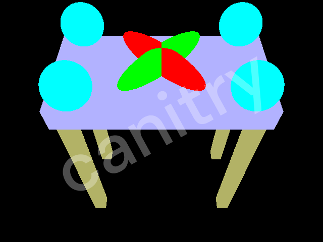
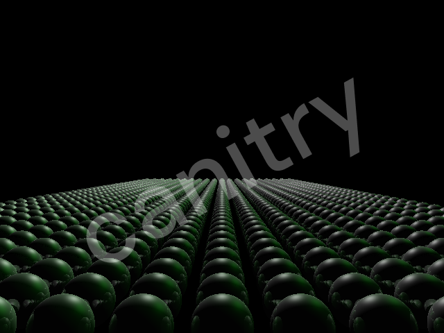
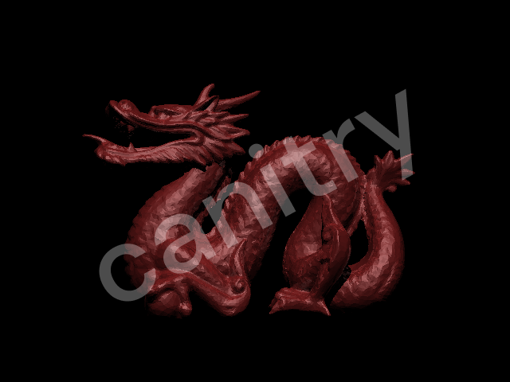

## Direct Lighting Modes

Two Direct Lighting modes are implemented, an analytic solution (which does not account for shadows) and a solution that uses Monte Carlo.  

| Ambient | Emission | Diffuse | Specular | Scene 5 | Scene 6 | Scene 7 |
|--|--|--|--|--|--|--|
 |  |  |  |  |  | 

## 1 Analytic Solution {#analyticsol}

The analytic solution is limited in that it becomes exponentially more difficult as the lights to be rendered become more complex and there are shadows between objects.
This solution, as a result, does not account for shadows.

The benefit, however, is that the images do not have noise.

## 1 Monte Carlo Solution {#montecarlodir}

You can adjust the number of samples per light in our direct lighting calculations. The default is 1 light sample per light.

There is toggleable light startification which dramatically improves the quality of the render. The default is to turn off this mode.
