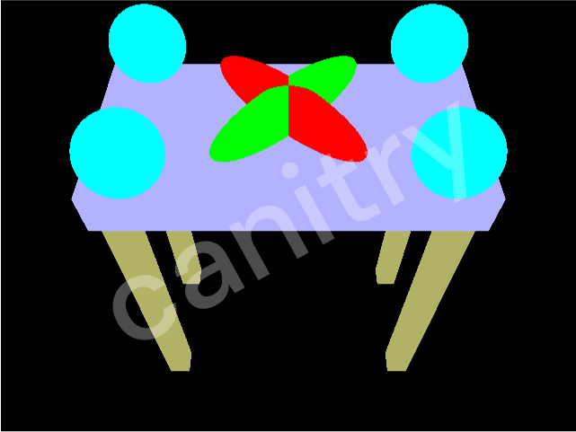
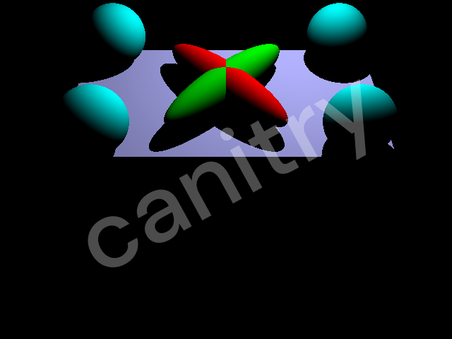
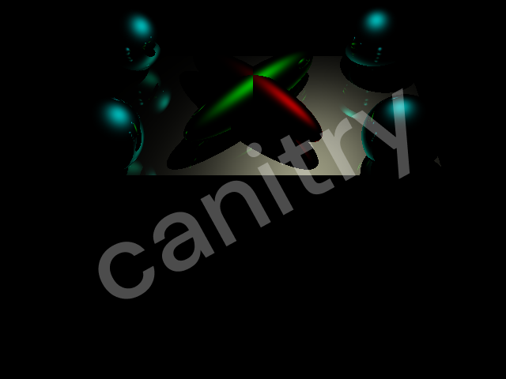
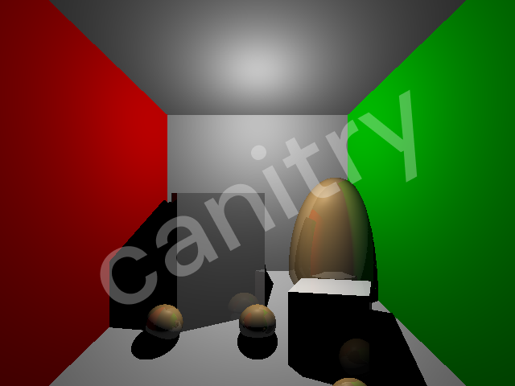

# Simple Ray Tracer

A RayTracer that renders triangles and spheres and ellipsoids with Blinn-Phong shading, mirror reflections, transformation stack, and a BVH acceleration structure based on the skeleton code and tutorial from the [CSE 168 OptiX Tutorial](https://github.com/CSE168sp20/CSE-168-OptiX-Tutorial/tree/master).  

This assignment is created for Assignment 1 of the CSE 168 Spring 2024 course at UCSD with Ravi Ramamoorthi.

| Ambient | Emission | Diffuse | Specular | Scene 5 | Scene 6 | Scene 7 |
|--|--|--|--|--|--|--|
 |  |  |  |  |  | 

## Content of Note  
[Rendered Images](#images)  
[Acceleration Structure](#bvh-optix)

## 1 Ray Generation {#ray-gen}

The ray tracer determines where to shoot the rays using the following concept:  

  

A camera has a point ("lookFrom") where all rays converge and has their origin at, an up direction to determine where the top of the camera is, a direction the camera is looking at, and a fov in either the vertical or horizontal direction, which determines how tall the beam of rays should be vertically (for vertical fov) or wide horizontally (for horizontal fov). The beam split into a grid of smaller beams, each corresponding to one pixel in the image, and the aggregate color and value of this beam is approximated by shooting a single ray through the center of each pixel when the image is mapped onto the beam.  

Thus, our initial ray generation has $width * height$ rays generated with each ray having an origin at 'lookFrom' with a direction from lookFrom to the center of its corresponding pixel mapped to the beam.

For our scene, the `.test` file, specifies the location where all rays from the camera (termed "lookfrom" in UCSD Online's CSE168x), the location the camera is looking at (also termed "lookat" in UCSD Online's CSE168x), and the fov in the y direction, along with image width and height in pixels.

Since we have "lookfrom" we simply set origin to this value.

To find the direction, we can think of it as the image of width and height pixels being centered at the location the camera is looking at, and facing the camera parallel to the up vector, and scaled in the y direction based on the fov-y and scaled in the x direction based on fov-x (which we derive based on fov-y to preserve the scaling of the image). Then, we find the location of the center of these pixels using trigonometry.

Then, we subtract from this location the "lookFrom" value and normalize to find the direction that shoots through the center of each pixel.

(Note: in the `.test` file provided, the fov y is in degrees, not radians, not knowing this left me with some headscratching for a while, you simply convert to radians while parsing.)

## 2 Ray-Surface Intersection {#ray-surface}

When make_Ray() is called,  determines the type of ray. Of which 1 is a ray for which closest_hit() will be called, which calls intersect() for each object in the scene (or determined as an object the ray could potentially intersect with by the acceleration structure) and finds the intersection which is closest to the ray.

### 2.1 Transformations {#transformation}

The `.test` file takes advantage of a matrix-stack which is applied when the scenes are loaded.

`pushTransform` copies the top of the stack and should be done every time someone wants to create a matrix for an object. (So, if we are translating a single triangle 0,0,1, we want to call pushTransform first, this is so that we always have the Identity matrix at the bottom of the stack).

`popTransform` removes an object from the stack

`translate` and `scale` all use three floating points to represent x,y,z and `rotate` has a fourth additional value to represent the angle in degrees the object should rotate while the previous three values defines the axis the object rotates around.

Each shape (triangle, and sphere) stores the transformation matrix to world space along with the inverse of the matrix.

To do the intersection tests with transformed objects, we simply transform the ray by the inverse matrix to the model space of each object, Check that `t` in the model space (where `t` is how much you have to move along the ray to get to the intersection point) is not negative (ie. the object is not intersecting behind the ray), then find the intersection point. Then, we transform the intersection point in model space back to world space with object's world matrix, then find the magnitude of the vector formed by intersection point minus the ray origin to find `t` in the world space.

(Note: not checking negative `t` leads to fun errors like these

)

Then, we pass these values to OptiX to check if the intersection is within the minimum and maximum `t` for which the intersection is considered valid through `PotentialIntersection(t)`, then if valid, we set all attributes and variables the materials program might need and report the intersection to OptiX to handle.

Normals of triangles can be saved to the triangle at scene loading, and the direction of the triangle vertices are counter-clockwise in the scene file.

For all normals, they can be found in model space then transformed to world space with the inverse transform of the WORLD matrix.

### 2.2 Triangle

Intersection with a triangle is determined by finding the point at which the line of the ray intersects with the plane the triangle is on, then, we check whether the intersection point is behind the ray (and so cannot have been hit by the ray), and if not, we check further whether the point is inside the triangle -- if it does, we consider it an intersection.

To determine whether the point is inside the triangle, we use barycentric coordinates. 

Rather than solving the equations
from
$$\overrightarrow{P} =\alpha \overrightarrow{A}+\beta \overrightarrow{B} + \gamma \overrightarrow{C}$$
where
$\alpha, \beta, \gamma \geq 0$
and the point is inside the triangle if
$1 =\alpha +\beta + \gamma $.

I used an area based method I learned from CSE 167

Note: This method requires $\alpha, \beta, \gamma$ to all be found by the area method then summed to check that their sum is within $1 \pm 0.001$ (0.001 is an arbitrary epsilon padding). This is because when solving the equation while replacing $\alpha$ with $\alpha = 1-\beta - \gamma$, we are requiring that $1 = \alpha + \beta + \gamma$ (ie. the barycentric coordinates must be inside the triangle) then determining whether or not such barycentric coordinates can exist while the area method finds the barycentric coordinates then checks that they are inside the triangle.

### 2.3 Sphere

For spheres, we simply solve for the intersection point, which amounts to using the quadratic formula.

## 3 Lighting and Shadows {#light-shadow}

$$I=K_a+K_e+(\Sigma_{i=1}^nV_iL_i(K_dmax(l_i\cdot n, 0)+K_s(max(h_i\cdot n, 0)^s)))+K_sI_r+K_tI_t$$

$I$ is the radiance of the ray. It is what `payload.radiance` will be set to, or the resulting color of the ray.

The $K$ values are not treated as vectors here, but often have different values for the different the RGB channels so are stored as vectors. OptiX allows vector3_1\*vector3_2 to just be (vector3_1.x\*vector3_2.x, vector3_1.y\*vector3_2.y, vector3_1.z\*vector3_2.z).

$K_t$ is the transmission value of the object, and is NOT implemented

### 3.1 Blinn-Phong Shading with Direct Shadows {#blinn-phong}

$$I=K_a+K_e+(\Sigma_{i=1}^nV_iL_i(K_dmax(l_i\cdot n, 0)+K_s(max(h_i\cdot n, 0)^s)))$$

### 3.1.1 Ambient and Emission

$$K_a+K_e$$

$K_a$ is just the global ambient value directly parsed from the scene. In our scene file, it can be changed throughout the scene, so different objects may have different global ambient values.

$K_e$ is just the emission value of the object directly parsed from the scene.

### 3.1.2 Diffuse and Specular with Shadows {#shadow-ray}

$K_d$ is the diffuse value of the object directly parsed from the scene.

$l_i$ is the light direction, from the intersection point to the light source

$K_s$ is the specular value of the object directly parsed from the scene.

$h_i$ is the halfway vector, which is $\frac{l_i+v}{|l_i+v|}$ where $v$ is the view vector (the vector from the intersection point to the viewer's eye). It can also be derived from the reflection vector, which is the mirror reflection of $l_i$, but I used the first formula because it seemed simpler.

$s$ is the shininess of the object and will control how sharp the specular highlight is, it is also often termed $\alpha$ in texts on the subject.

$V$ is whether the shadow ray returns visible, wherein a ray is shot from the intersection point to the light position (for point lights) or in the direction of the light (for directional light) and if it hits an object before it reaches the light (the distance between the intersection point and the light for point lights and the maximum distance OptiX offers for rays for directional light), then the point is in direct shadow from the light and we do not calculate diffuse or specular in the Blinn-Phong.

For the shadow ray, we want to move the origin of the ray along the direction of the ray a tiny epsilon so that we don't get 'shadow acne' where the ray intersects with the object it is bouncing off of in the first place. Do not set this epsilon to be the same as the epsilon fed into the make_Ray() as it seems to create shadow acne. The epsilon offsetting the origin should be smaller than the epsilon of the make_Ray().

### 3.2 Mirror Reflection via Recursive Raytracing {#reflection}

$K_t$ is the transmission value of the object, and is NOT implemented

$K_sI_r+K_tI_t$ are recursive terms, meaning $I_r$ and $I_t$ are each the radiance of the ray shot from the intersection point before it hit the current object, the ways these ray directions are decided differ between $I_r$ and $I_t$.

The $I_r$ basically sees how a ray would reflect if the objects were mirrors. Thus, it shoots a ray off in the mirror direction in came in from with respect to the surface normal from the intersection point.

While the tutorial recommended sending off the rays interatively in a while loop rather than recursively, the current implementation for my program uses the recursive method.

I may edit this later on, but it seems as though my computer is handling it fairly well.

(Note: in the tutorial, the iterative code is not in closestHit(), that would result in pandemonium, it is located in the rayGen program).

## 4 Acceleration Structure: OptiX Bounding Volume Hierarchy {#bvh-optix}

OptiX offers a BVH acceleration structure, so we simply have to let OptiX know that we would like a BVH acceleration structure and define the bounding boxes for the objects in the bound() function of each object.

For spheres, the bounding boxes are found by taking the bounding box of the sphere, whose minimum and maximum corners are () and () respectively, then transforming the vertices to world space and find which the minimum and maximum x, y, and z's. These values are given to `result[6]`, the first three are the minimum, the second three are the maximum.

For triangles, we can directly transform the vertices of the triangle to world space then find the minimum and maximum x,y,z's from the transformed vertices. Then define a bounding box by passing those values into `result[6]` in the same way.

## 5 Rendered Images {#images}

